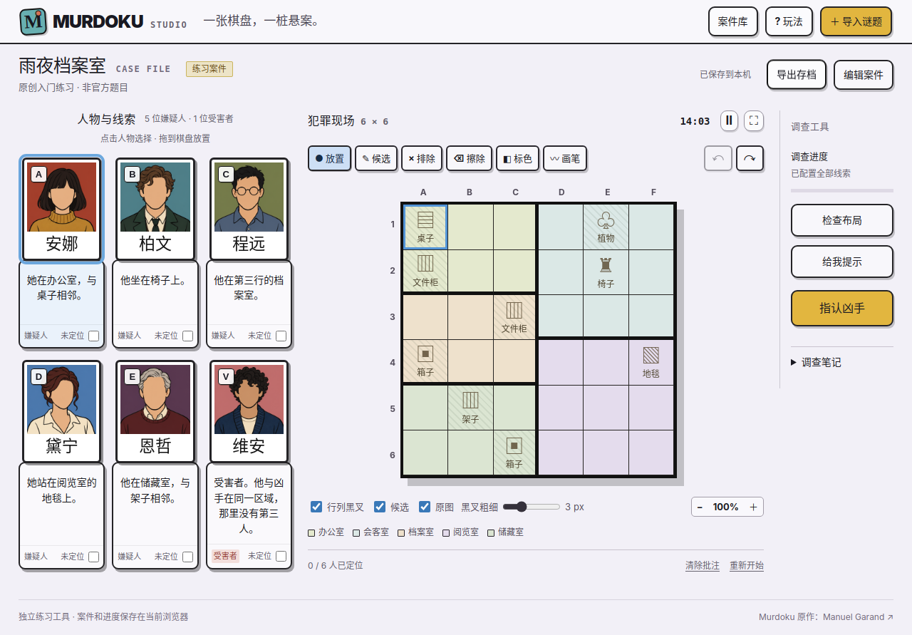
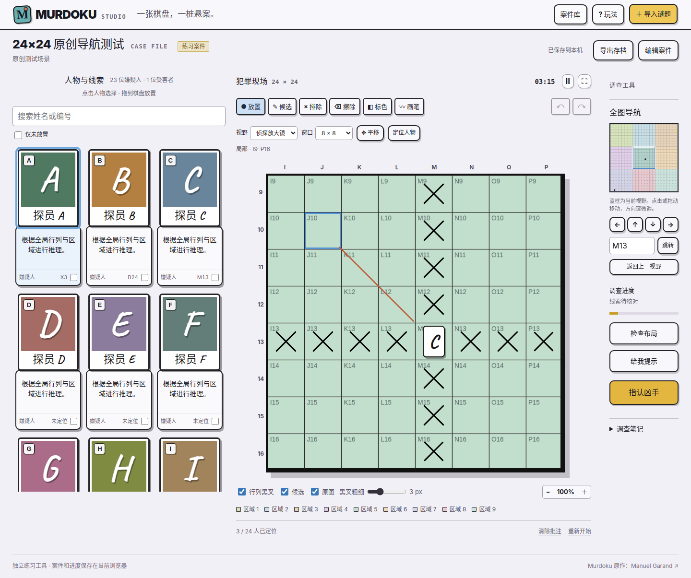

# Murdoku Studio

**English** | [简体中文](README.zh-CN.md)

Turn PDF logic puzzles into an interactive Murdoku board. Import a page, align its grid, and solve with portrait tokens, candidate notes, and automatic row/column exclusions.

**v1.1.0 · Web UI edition.** Run a small local Python server and use the app in your browser. The current interface is in Simplified Chinese; the documentation is available in English and Chinese. This release provides source code, with no desktop or mobile application package.



An independent fan project, not affiliated with Murdoku. The included practice case and character illustrations are original. Official puzzle PDFs are not bundled.

## Features

- Import multi-page PDFs, PNG/JPEG/WebP images, official PDF links, or exported JSON saves.
- Explore large maps through a 6×6, 8×8, 10×10, or 12×12 viewport with a draggable mini-map, global coordinates, and per-page view recovery.
- Review and edit names and clues before import; compare the original page while editing, and recalibrate the board crop later.
- Detect a candidate grid and adjust it by dragging, resizing, or entering exact coordinates.
- Match person IDs to name initials; find nearby portrait frames and crop portraits from the source page. Correct portrait crops manually.
- Place or drag people onto the board. Show automatic black crosses across occupied rows and columns, with adjustable thickness.
- Record candidates, exclusions, cell colors, freehand marks, completed clues, and case notes.
- Undo/redo, zoom, fullscreen, timer, and pause controls.
- Edit rooms, objects, blocked cells, people, and structured rules. Check conflicts, request a unique-solution hint, and identify a suspect using verified rules.
- Save cases and per-page progress in the browser. Export and restore the current page as JSON, including portraits and source artwork.

## Install and run

### 1. Get the source

Download **Code → Download ZIP** from the repository and extract it, or clone this repository with Git. Open a terminal in the repository root—the directory containing this README and the `murdoku-studio/` folder.

### 2. Install the prerequisites

| Requirement | Purpose |
| --- | --- |
| Python 3.10+ | Local HTTP server; standard library only |
| Poppler: `pdfinfo`, `pdftoppm`, `pdftotext` | PDF rendering and text extraction |
| A modern browser with JavaScript and IndexedDB enabled | Web UI and local saves |
| Node.js 20+ with npm, optional | Development checks and tests only |

There are no pip or npm runtime dependencies and no frontend build step.

**Ubuntu / Debian**

```bash
sudo apt-get update
sudo apt-get install python3 poppler-utils
```

**macOS**, with [Homebrew](https://brew.sh/) installed:

```bash
brew install python poppler
```

Poppler is distributed through the [Homebrew formula](https://formulae.brew.sh/formula/poppler).

**Windows:** use Ubuntu in [WSL](https://learn.microsoft.com/en-us/windows/wsl/install). If WSL is not installed, run this in an administrator PowerShell terminal, restart if prompted, and complete Ubuntu setup:

```powershell
wsl --install -d Ubuntu
```

Then run the Ubuntu commands and the server command below inside the Ubuntu terminal. Open the UI in your Windows browser. Native Windows installation is not covered in this release.

**Optional English OCR:** install Tesseract and its English language data to attempt text extraction from image-only PDFs. On Ubuntu/Debian/WSL use `sudo apt-get install tesseract-ocr tesseract-ocr-eng`; on macOS use `brew install tesseract`. See the [Tesseract installation guide](https://tesseract-ocr.github.io/tessdoc/Installation.html). OCR is a fallback when a PDF has no extracted text, not a guarantee of accurate names or clues; standalone image imports still require manual text entry.

### 3. Start the Web UI

Run from the repository root:

```bash
python3 murdoku-studio/server.py --port 8000
```

Open **http://127.0.0.1:8000**. Keep the terminal running; press `Ctrl+C` to stop the server. The original practice case is available immediately.

Verify PDF support at **http://127.0.0.1:8000/api/health**: the `pdf` field should be `true`. If it is `false`, install Poppler and ensure all three commands are on the server's `PATH`.

To use a different port, pass `--port 8001` and open the matching URL. Browser saves belong to each origin, so changing the host or port starts a separate save library; export your progress before switching.

## First puzzle

1. Click **导入谜题** (Import puzzle) and choose a PDF or image. Each file can be up to 32 MiB; PDFs can have up to 300 pages.
2. Select a page. Confirm that the selection covers the main board, then correct the row, column, and person counts.
3. Convert the page. Review extracted names, initials, clues, and portraits before solving.
4. To correct a portrait, open **编辑案件 → 人物与规则 → 调整头像框** (Edit case → People and rules → Adjust portrait). Move or resize the frame, click **应用头像** (Apply portrait), then **保存案件** (Save case).
5. Select a person and click a cell, or drag their card onto it. Use the other tools to record deductions. Saving happens automatically; use **导出存档** (Export save) for a backup.

For rule-aware checking and hints, first define rooms, objects, and each person's rules in the case editor. Mark a person's clues as fully configured only after reviewing them. You can solve manually without configuring rules.

## Large maps

Boards with either dimension at least 16 open in an 8×8 viewport. Smaller boards keep the full view. Choose a window size, click or drag the blue frame on the mini-map, or enter a global coordinate such as `M13`. Use **✥ 平移** (Pan) or the middle mouse button to drag the board. On the mini-map, arrow keys move one cell; Shift moves by the window size minus two cells.

Global row/column exclusions include people outside the viewport. Letter badges on the coordinate axes identify those people and jump to their location. **定位人物** locates the selected person; **返回上一视野** returns to an earlier view in the current session. Switching views does not create a game undo step. On large boards, clicking the full-board overview opens a local view; it does not place a person.

Placements, candidates, and ink remain attached to global coordinates. The view is saved per PDF page and included in JSON exports. Large PDF imports are rendered again with a 3600-pixel maximum page dimension for clearer artwork. Existing imports retain their original resolution until reimported. People can be searched or filtered to show only unplaced characters.



## Scope and limitations

- Text extraction, grid detection, and portrait matching produce suggestions. For **Preppers**, manually align the **9×9** main board; the current grid detector can choose the wrong region.
- Portrait matching targets rectangular frames above extractable name labels. Scans, unframed artwork, and other layouts may require manual cropping. English OCR is optional for image-only PDFs; there is no automatic gender inference.
- Natural-language clues, room boundaries, and furniture are not automatically converted into verified rules. Hints and accusations use the rules you configured, not an official answer database. Search limits can prevent a conclusive result.
- JSON exports contain the current page and its progress, not the entire PDF book. Export each page separately. Editing a case clears its undo history.
- The magnifier applies to the playing board. The room/object editor still shows the whole board for annotation.
- Cases without a designated victim can be saved and solved manually, but murder completion and solver hints remain unavailable. Large-map support does not implement a contest-specific treasure-chest objective.
- This is a local Web UI, not a hosted service. PDF import needs the Python backend; GitHub Pages alone cannot run the complete app. Feature parity with the official online game has not been established.

## Storage and troubleshooting

The server listens on `127.0.0.1` by default. Files are processed by your local Python service; temporary conversion files are removed after processing. Browser saves use IndexedDB. Clearing browser data removes those saves. The app does not upload cases to a cloud service.

| Problem | Action |
| --- | --- |
| Blank page after opening `index.html` | Start the Python server and open its HTTP URL. |
| PDF conversion unavailable | Check `/api/health` and install Poppler. |
| Official PDF link fails | Download the file yourself and import it locally. |
| Old cases appear missing | Use the same browser, hostname, and port as before. |
| Port already in use | Choose another `--port`, keeping the separate-save-library behavior in mind. |
| Server runs on a remote machine | Use an SSH tunnel: `ssh -L 8000:127.0.0.1:8000 user@server`, then open the local URL. |

## Development

From the repository root, with Node.js and Poppler installed:

```bash
npm --prefix murdoku-studio run check
npm --prefix murdoku-studio test
python3 murdoku-studio/tests/pdf_fixture.py
```

`check` validates JavaScript syntax and compiles the Python server. `test` runs the Node.js rule/import tests and Python PDF/HTTP tests. The fixture command regenerates the original two-page test PDF. No `npm install` is required.

```text
.github/workflows/        GitHub Actions checks
AGENTS.md                Contributor guidelines
README.md                English introduction and installation
README.zh-CN.md           Chinese introduction and installation
docs/                    User guide and curated screenshots
murdoku-studio/
  server.py              HTTP server and Poppler integration
  public/                Native ES modules, styles, and local assets
  tests/                 Node.js and Python tests; original PDF fixture
```

The CI workflow runs checks and tests on pushes and pull requests. See [Repository Guidelines](AGENTS.md) before contributing. For UI changes, include screenshots and describe your browser checks. Keep personal puzzle files, exported saves, credentials, and generated output out of commits; `.gitignore` excludes these while retaining the original fixture and project assets.

For the prepared source package, see [Upload to GitHub](docs/PUBLISH.md).

See [v1.1.0 merge notes](docs/RELEASE_NOTES.md) for verification and save compatibility.

## Credits

Inspired by [Murdoku](https://murdoku.com/play/) and the [Murdoku Fans Assistant](https://murdoku.fans/zh/murdoku-assistant/). See [third-party notices](THIRD_PARTY_NOTICES.md) and [asset provenance](murdoku-studio/public/assets/README.md) for the bundled font, original illustrations, and their source information.
